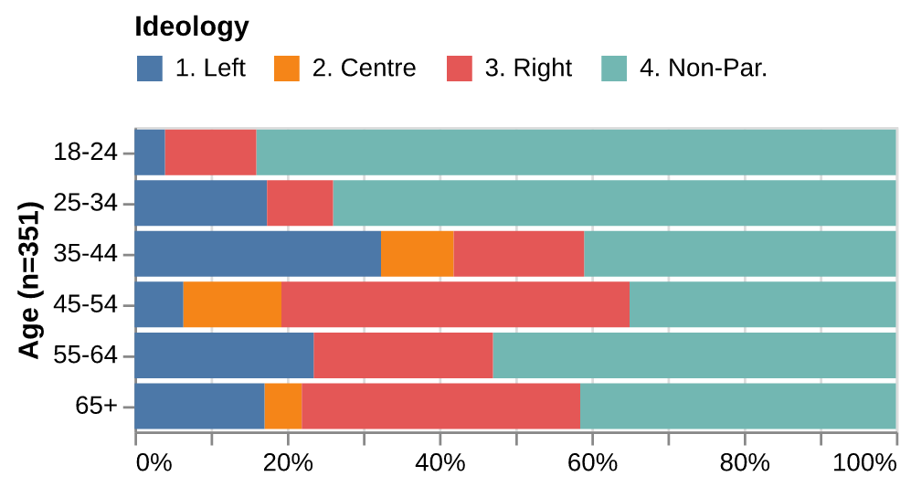

# Introduction
Provide an brief overview of the research topic and its significance. Clearly state the research question and your hypothesis that your study aims to address. 

> $H_1$: My hypothesis description

Include any necessary background information and the objectives of the study. What has been done, and the current limitiations. 

Do not forget to include relevant sources in the `references.bib` file.

- All **sources are leveraged** and put in perspective in the document.
- Use in-text citations by using citation keys from the `references.bib` file, such as `[@brady1995beyond]` for parenthetical citations or `@brady1995beyond illustrate that...` for narrative citations.

Here is an illustration: Recent studies have explored the intersection of gender and political engagement, highlighting significant findings. For instance, @dassonneville2018gender argue that gender influences voting behavior, particularly in how candidates are perceived. Similarly, the role of social networks in political participation cannot be overstated as access to resources significantly impacts political involvement [@brady1995beyond].

## Writing Tip
- **1 page** = ~5 paragraphs
- **1 paragraph** =  ~5 sentences = 1 idea
    - The first sentence in a paragraph introduces the idea.
    - Followed by three sentences written has arguments supporting the idea.
    - The last sentence concludes the idea.
- **1 sentence ** = ~20 words
- Your final paper is less than **4000 words.**

# Data and Method
Describe the data used in your research, including how it was collected and any relevant characteristics. Explain the methodologies and techniques employed to analyze the data, ensuring clarity and reproducibility.

{width=55%}

# Analysis and Results
Present the findings of your research. Use tables, figures, or graphs to illustrate key results, and provide a narrative that explains the significance of these findings in relation to your research question.

# Conclusion and Discussion
Summarize the main findings of your study and discuss their implications. Address how your research contributes to the broader field and suggest possible areas for future research. Discuss any limitations of your study and how they might affect the results.

# References

